## 최적화 대상
- 블로그 게시글 목록 페이지, 상세 페이지
- 아무리 느리게 구현되어 있어도 버벅거림을 알기 어렵지 않을까 생각했지만, 이 예제는 정말 잘 버벅거리게 구현해놓았다!

## 간단 이론 정리
- 이미지 최적화: 적절한 이미지 사이즈로 결정해야 한다. (작아도, 커도 문제)
- 코드 분할: 번들 단위로 JS를 다운로드하기 때문에 첫 페이지 로딩 시 불리하다.
- 병목 코드 최적화
- 크롬 개발자 도구
	- 열기: Ctrl + Shift + i (F12)
	- Network 탭
		- 리소스 로딩 시점, 크기
	- Performance 탭
		- 자바스크립트를 포함해 브라우저에서 실행되는 작업의 길이와 호출 스택을 표시
	- Lighthouse 탭
	- webpack-bundle-analyzer
		- Webpack의 번들 결과물에서 각 라이브러리의 비중을 표시
- Lighthouse
	- Mode: 초기 로딩 성능, 특정 녹화 기간 성능
	- Categories: 로딩 성능, 접근성, 표준 준수, SEO, PWA
	- 지표 가중치:
		- FCP 10% - 첫 콘텐츠 렌더링 완료 시각
		- SI 10% - 콘텐츠 표시 속도 (?)
		- LCP 25% - 가장 큰 콘텐츠 렌더링 완료 시각
		- TTI 10% - 사용자 이벤트 처리를 할 수 있게 되는 시각 (?)
		- TBT 30% - FCP ~ TTI 간 시간 (응답이 없는 시간)
		- CLS 15% - 렌더링된 콘텐츠가 이동하는 .. (횟수? 시간?)

## 질문 
- Lighthouse 지표 - Speed Index란? 
    - https://medium.com/jung-han/%EB%9D%BC%EC%9D%B4%ED%8A%B8%ED%95%98%EC%9A%B0%EC%8A%A4-%EC%84%B1%EB%8A%A5-%EC%A7%80%ED%91%9C-%EC%82%B4%ED%8E%B4%EB%B3%B4%EA%B8%B0-83df3dc96fb9

- Q. `lazy('./pages/ListPage/index');`와 같이 되어 있을 때
	- webpack이 어떻게 번들을 나누는 원리 = ?
	- React가 분리된 번들을 가져오는 원리 = ?

## 직접 해보기 1 - Project Clone
- GitHub Clone: https://github.com/performance-lecture/lecture-1
- 실행 오류: `"start": "NODE_OPTIONS=--openssl-legacy-provider react-scripts start",`

## 직접 해보기 2 - 이미지 크기 수정하기
- Lighthouse로 이미지 최적화 가능성 확인: 
	- 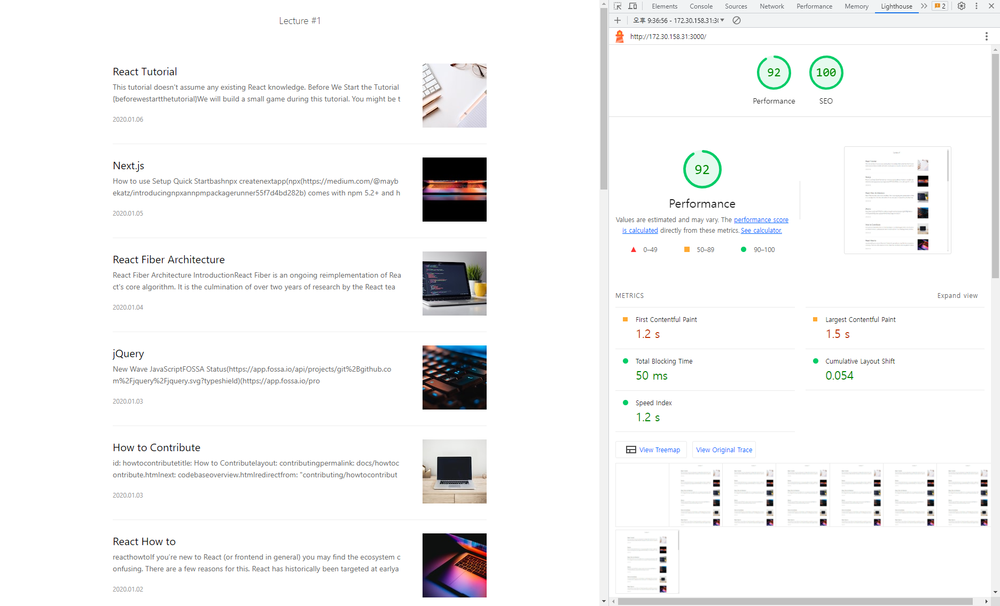
- 이미지 크기 변경은 Unsplash query만 수정하면 되어서 매우 쉽다.
- Retina Display를 고려해 이미지 자체 해상도는 4배(2배x2배)로 둔다.

## 직접 해보기 3 - 느린 JS 제거
- 게시글 목록 페이지 최적화 전: 
	- 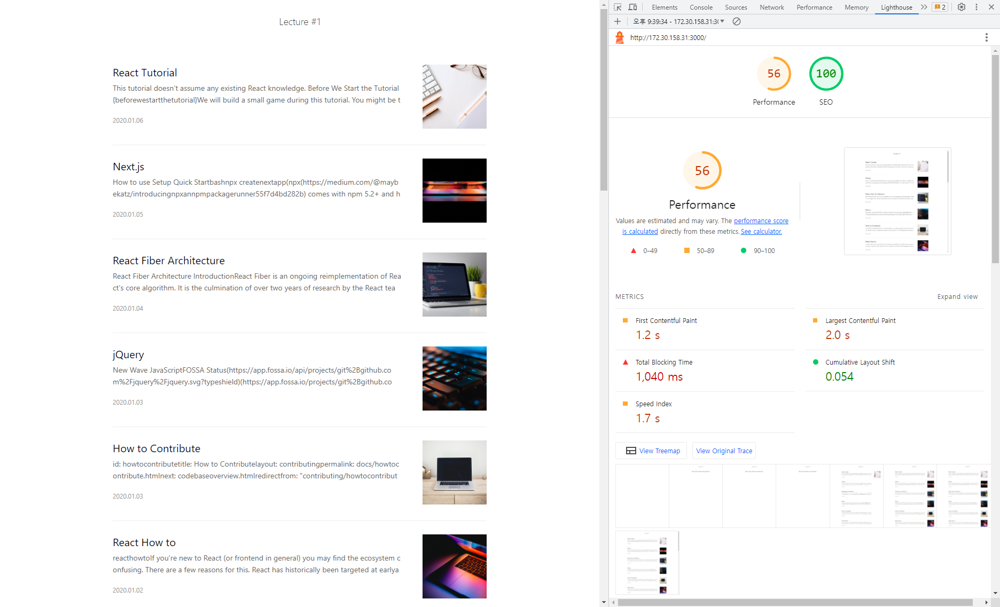
- Long running task가 1.07s가 걸리면서 목록을 그리지 못하는 Idle Frame이 1350ms임을 확인할 수 있다: 
	- 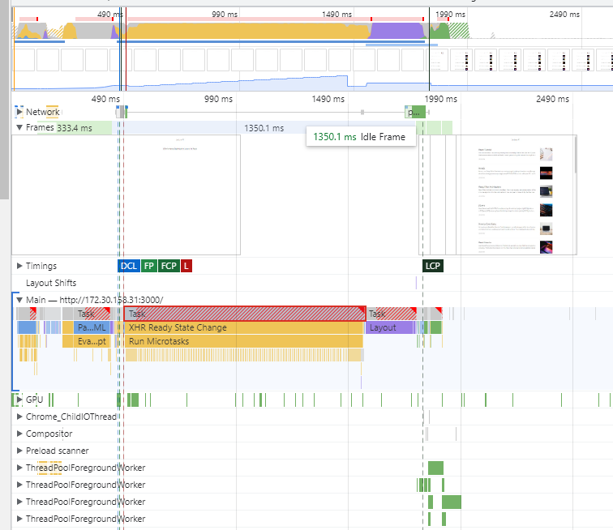
- Timings 탭을 확인하면 `Article [mount]`에 944ms가 걸림을 알 수 있다: 
	- 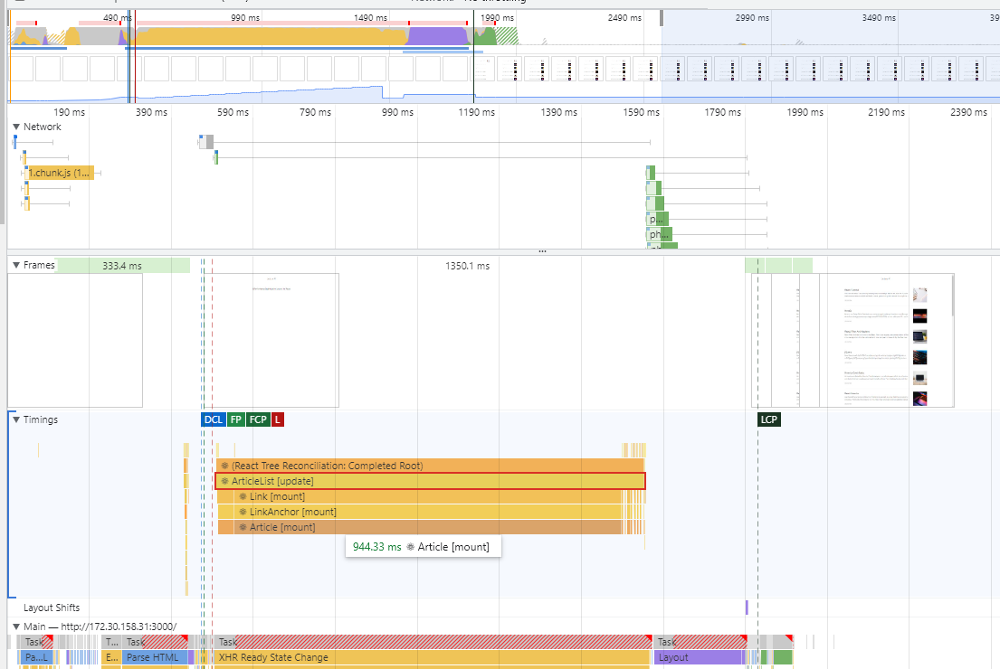
- 게시글 목록 페이지 최적화 후(size 축소, 본문 slice): 
	- 
- `ArticleList [mount]`에 25ms가 걸리는 모습: 
	- 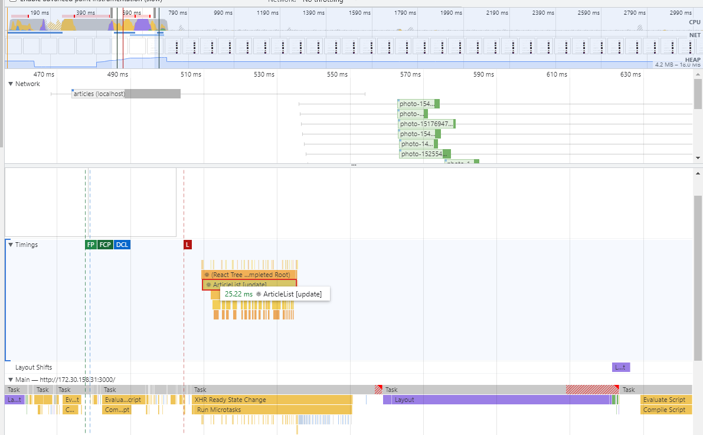

## 직접 해보기 4 - 번들 크기 확인
- 빌드된 코드는 Performance 탭으로 보면 함수 이름이 짧아져있어 이해하기 어렵다.
	- 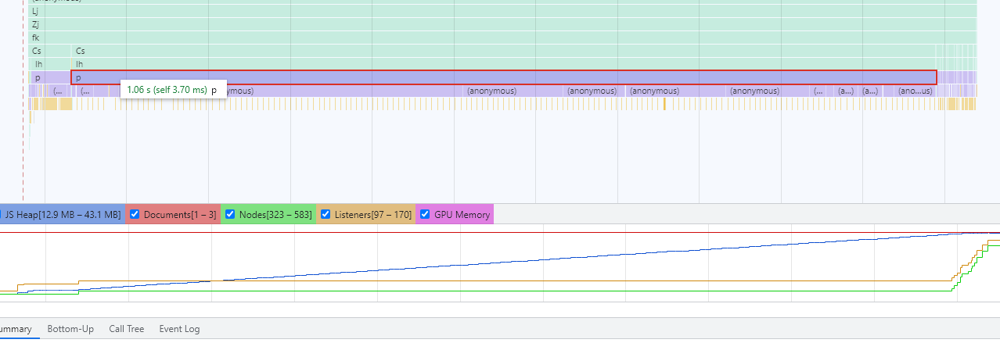
- Dev Server 코드는 Performance 탭에서 함수 이름을 확인할 수 있다.
	- 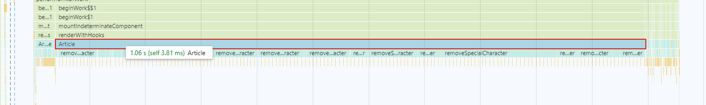
	- Q. 왜 함수 실행이 뚝뚝 끊길까?
- `0.chunk.js`의 다운로드 시간이 6.4s ? Fast 3G로 하니 재현되었다.
	- 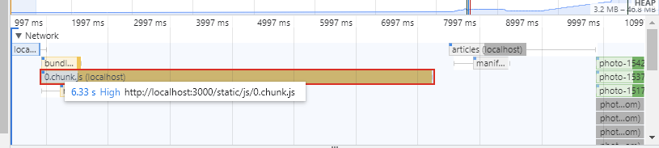
	- 집에서는 180ms정도여서, 네트워크가 느릴수록 다운로드 시간이 크게 늘어나는 것 같다.
- webpack-bundle-analyzer로 크기를 확인할 차례.
	- CRA로 만들어서 eject할 수 없기 때문에 cra-bundle-analyzer를 사용한다.
	- 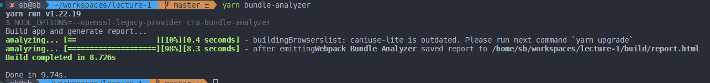
	- 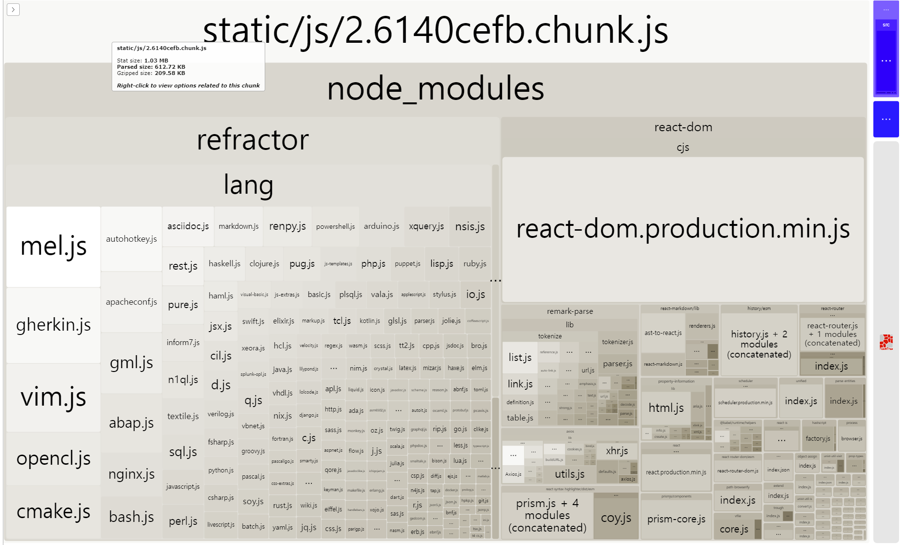
	- 제품 코드는 6kb 정도이고, 나머진 node_modules 코드(1.03MB)이다.
	- 둘이 다른 chunk로 번들링된다. 제품 코드가 main.chunk.js, node_modules는 2.chunk.js이다.

## 직접 해보기 5 - 번들 크기 축소 (지연 로딩)
- refractor.js가 거의 절반의 크기를 차지하고 있다.
- refractor.js는 react-syntax-highlighter에서 사용되고 있다.
- 문법 색상은 게시글 목록 페이지에서는 필요 없으므로, 해당 js는 상세 페이지 방문 시에 다운로드하도록 변경하면 번들의 크기를 줄일 수 있다.
- lazy의 대상이 될 때마다 다른 내용 하나 없는 별개의 js가 된다. (5.chunk.js, 6.chunk.js는 각 lazy 대상인 컴포넌트라고 한다.)
- 동적 import를 사용하면 하나로 bundling되지 않고 런타임 중 필요 시 다운로드 한다.
- 동적 import는 Promise를 반환하므로 컴포넌트에서 사용 불가능하다.
	- React에서 `React.lazy`와 `Suspense`를 제공하므로 이를 활용해 Code Split 가능
		- 아마 `lazy`는 최초 render 시 다운로드를 시작하고 Promise를 throw하는 게 아닐까?
- 목록 페이지의 번들 다운로드 시간이 절반으로(3s) 줄었다 - refractor가 사라졌기 때문.
	- 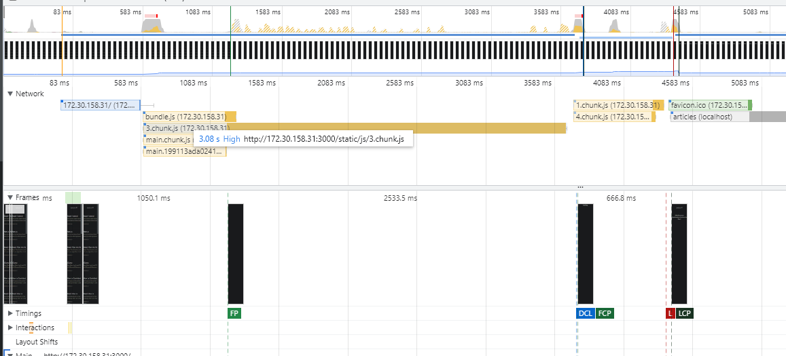
- 상세 페이지 방문 시 원래라면 없었을 bundle 다운로드가 생겼다.
	- 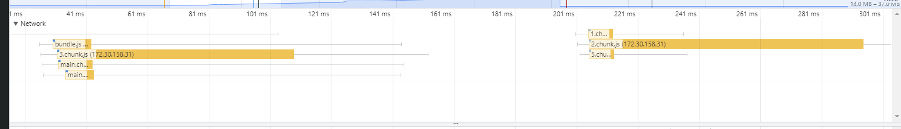
	- 앞은 `List, ViewPage`를 제외한 chunk고 뒤는 `ViewPage` chunk이다.
	- 최초 방문이 상세 페이지여서 bundle 2가지를 모두 다운로드하는 것이다.

## 직접 해보기 6 - 텍스트 압축
- 압축을 사용하는 경우 Response Header에 `Content-Encoding`이 들어가게 된다.
- `serve -u` 옵션으로 압축을 비활성화 했기 때문에 그렇다.
- 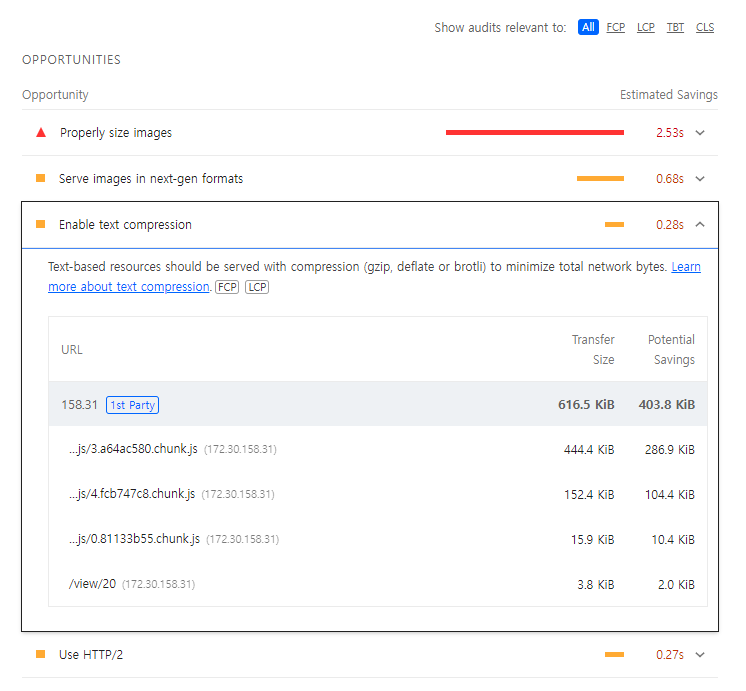
- minify된 후에도 압축 여부는 충분히 큰 것으로 보인다.
- JS 압축에 따라 여러 bundle의 크기의 합이 615KB -> 219KB 가 됐다.

## 직접 해보기 7 - 기타 팁
- Lighthouse에서 캡쳐한 내용을 `View Original Trace` 버튼으로 Performance 탭에서 볼 수 있다: 
	- 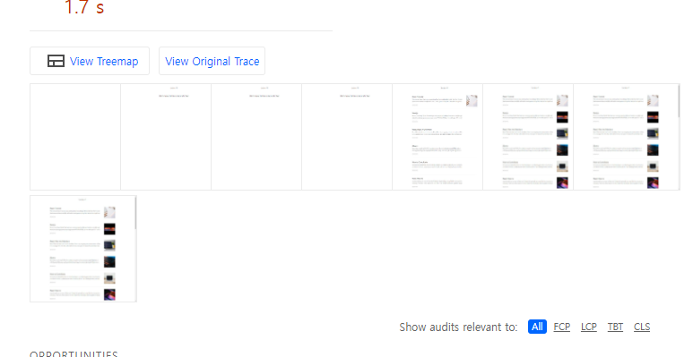
