## 최적화 대상 서비스
- 리우, 런던 올림픽 정보 및 사진 표시
- 설문 조사 결과 그래프로 표시

## 무엇이 느린가?
- 애니메이션...이라고 주장
	- 그러나 애니메이션이 느린 기색은 볼 수 없었음.
	- 흠..?

---

## 개념 1. 애니메이션 최적화

#### jank
- 6x slowdown으로 두면 차트 애니메이션의 프레임 드롭(jank)을 확인할 수 있다.
- 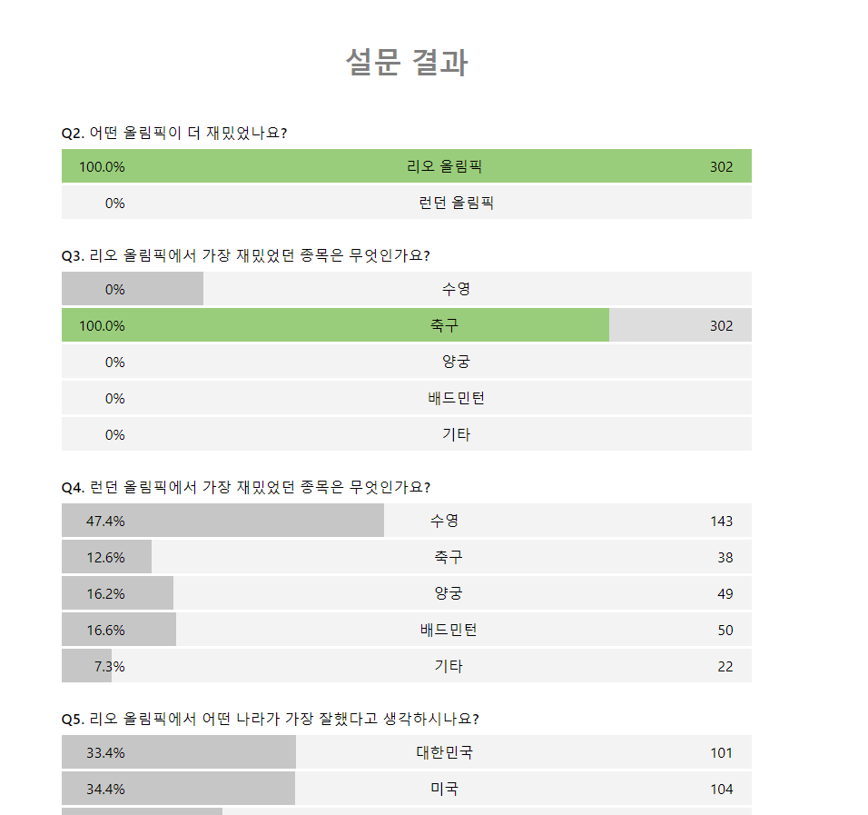
- `Bar` 컴포넌트
	- `width: ${({width}) => width}%; transition: width 1.5s ease;`
	- "브라우저의 원리를 알고 나면 이 코드가 불편하게 느껴질 것"

#### 애니메이션의 원리
- 여러 장의 이미지를 빠르게 전환하여 잔상을 남겨 움직이는 것처럼 느껴지게 하는 것.
- 애니메이션이 끊겨 보인다면 그 이유는 중간의 이미지가 사라졌기 때문.
- 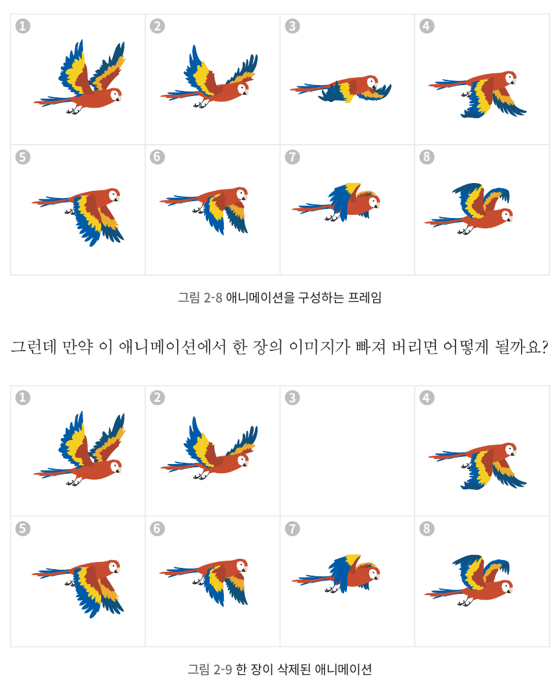
- 일반적인 모니터 = 60Hz, 1초에 60장의 이미지를 표시
- 브라우저가 초당 60 frame을 내지 못하는 이유는 "브라우저 렌더링 과정"에 있다.

#### 브라우저 렌더링 과정
- DOM + CSSOM = HTML, CSS 다운로드 후 파싱해 Tree로 생성
	- (각 트리가 실제로 어떻게 생겼는지 봐야만 이해가 가능할 것 같다.)
	- DOM = HTML Element 간의 관계
	- CSSOM = 태그 간의 상하 관계로 Tree를 생성 (e.g. html > body > p 등)
- 렌더 트리 = DOM 상의 HTML Element에 대해 CSSOM을 탐색해 최종 적용될 DOM + CSS를 만들고, `display: none;`인 요소를 제외한다.
- 레이아웃 = 렌더 트리의 HTML Element들에 대해 위치와 크기를 계산하고 이를 바탕으로 화면에 배치한다.
- 페인트 = 각 요소를 그림. 여러 레이어가 존재함.
- 컴포지트 = 여러 레이어를 합침.

#### 일부 화면의 스타일을 변경하는 경우
- 렌더링 과정을 또 거쳐서 새로운 화면을 그린다.
- 이를 Reflow, repaint 과정이라고 함.
- 예제의 `width`를 변경하는 경우 Reflow가 발생한다.
- 요소의 크기를 변경하지 않는 경우 Reflow가 아닌 Repaint가 발생한다.

#### Reflow, repaint 회피 방법
- `transform, opacity` 속성 활용 시 Layer가 분리된다.
- 해당 Layer는 GPU로 처리된다(하드웨어 가속).
	- Q. 애초에 모든 렌더링은 GPU로 되는 게 아닌가? 이 얘기는 CPU 렌더링이 기본인 것처럼 들린다(Blink는 CPU 렌더링?).
		- 전통적으로는 CPU 렌더링만 썼다고 한다.
			- https://www.chromium.org/developers/design-documents/gpu-accelerated-compositing-in-chrome/
			- 다만 브라우저 발전이 멈추지 않고 지속되어 왔고 빠르게 진행돼서 이제는 옛날보다 훨씬 성능이 좋은 듯하다. GPU도 기본으로 쓰나? 잘 모르겠다.
- Reflow, repaint 없이 Layer 합성 (Composite)만 실행한다.
- Tip
	- `transform: translate()`은 CSS 적용 시에 레이어 분리
	- `transform: translate3d()`와 `will-change`는 CSS 파싱 시 레이어 분리
		- 3d, will-change 사용 시 더 빠르나 레이어 분리에 따른 메모리 사용량 증가

#### 애니메이션 병목 확인
- 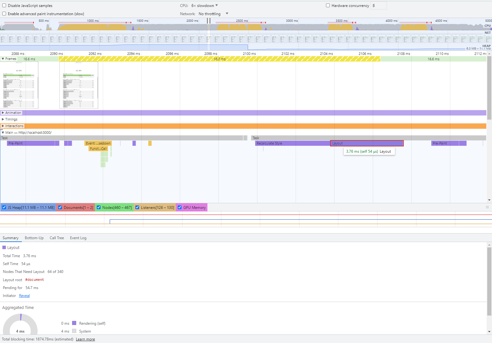
- Frames 서브 탭에서 노란 색이면 16.6ms을 초과했다고 보면 될까? 불분명하긴 하다.

#### 애니메이션 최적화
- `transform` 속성을 활용한다.
	- 위치 이동: `translate`
	- 크기 변경: `scale`
	- 회전: `rotate`
- 코드 변경
	- `scaleX` 사용 시 기준점이 중앙이어서 `transform-origin: left;`로 지정해줘야 한다.
		- 책에는 `center left`로 지정되어 있는데, `[y축 기준] [x축 기준]` 인 듯하다.
		- 예제는 height=100%여서 y축 `center`옵션은 필요가 없다.
		- 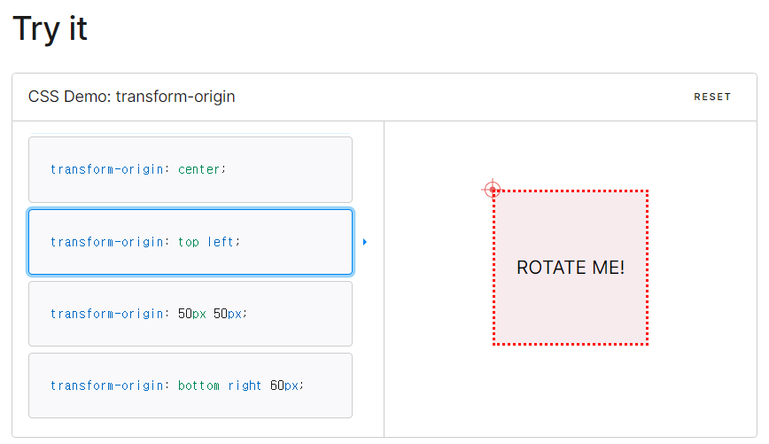
		- 출처: https://developer.mozilla.org/en-US/docs/Web/CSS/transform-origin
- 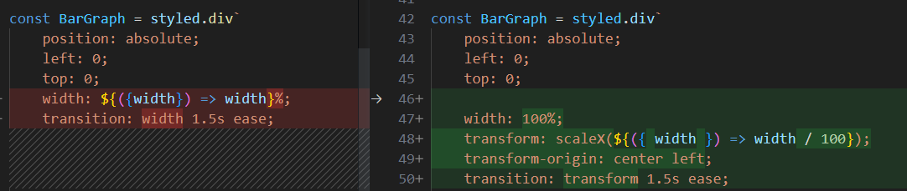
- 최적화 이후 성능 측정 - 6x slowdown 상황에서도 차트 관련 JS 실행 이외에는 프레임 드롭이 없다.
	- No throttling 상황이면 아예 프레임 드롭이 없다.
- 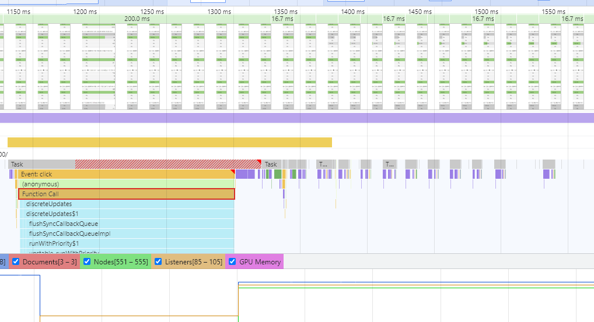

#### Layer가 정말 생긴다.
- 애니메이션이 시작되면 Layer가 생기고, 애니메이션이 종료되면 Layer가 사라진다.
- 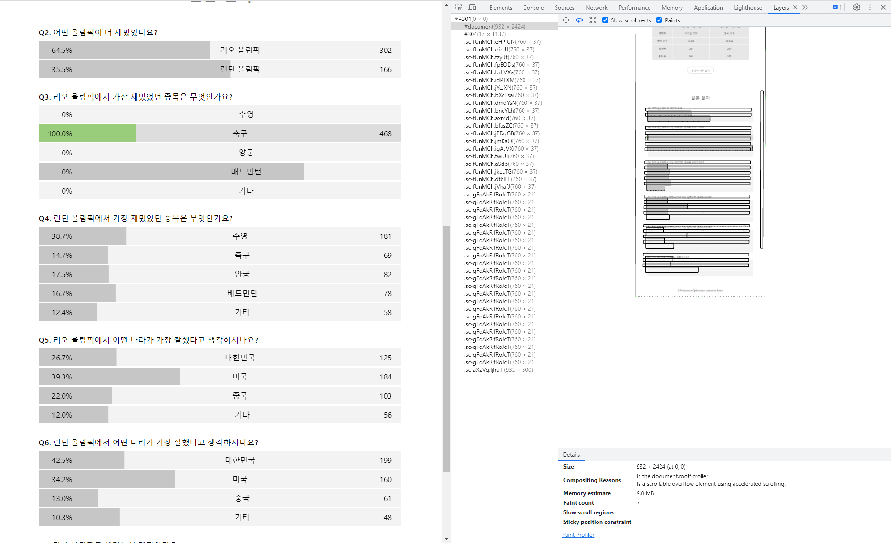

#### 애니메이션 렌더링 과정
- 
- Recalculate Style > Pre-Paint > Hit Test > Pre-Paint > Layerize > Commit
	- 각 단계에 대한 설명은 아직 잘 모른다.
	- Layer 관련해서 자세한 설명을 담은 글을 찾아서 조만간 이해하고 설명해보려고 한다.
		- https://so-so.dev/web/browser-rendering-process/

## 개념 2. Code Splitting

#### 번들 크기 분석
- 챕터 1에서 했던 것처럼 `cra-bundle-analyzer`를 사용해 시각화한다.
- gzipped 기준 node_modules 크기는 66KB인데, 이 중 13KB 이므로 약 20%를 차지하고 있다.
- 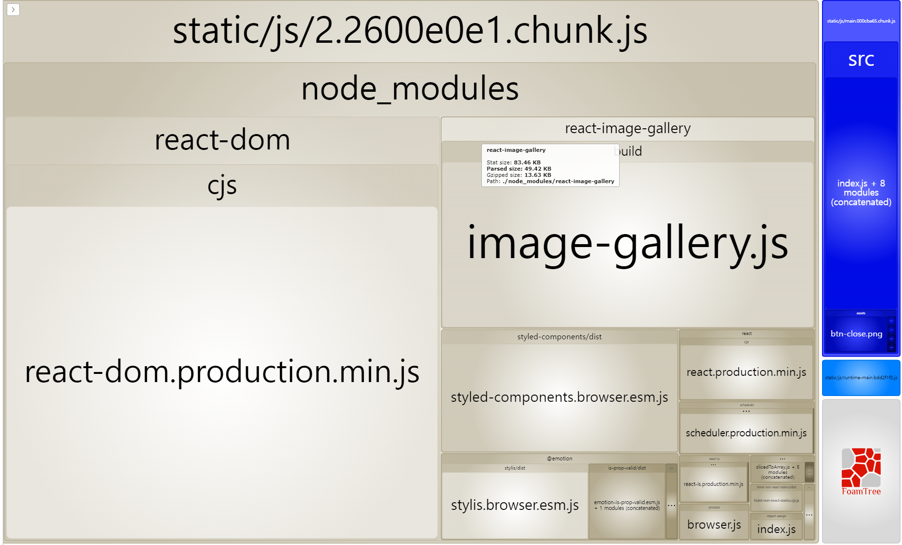

#### Modal Code Splitting
- Code Splitting은 `React.lazy`와 `React.Suspense`의 도움을 받아 굉장히 쉽게 수행할 수 있다.
	- 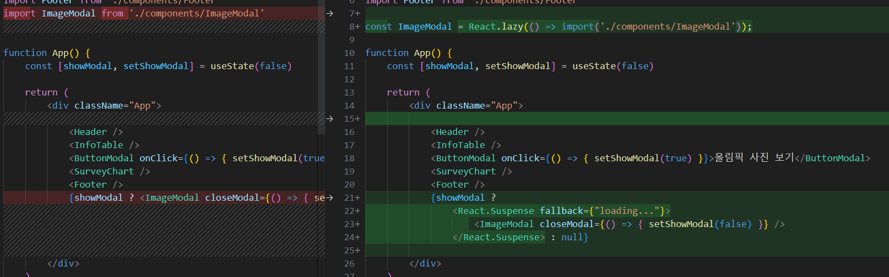
- 다시 번들 크기를 확인하면 node_modules의 크기가 66KB에서 52KB로 줄어든 것을 볼 수 있다.
	- 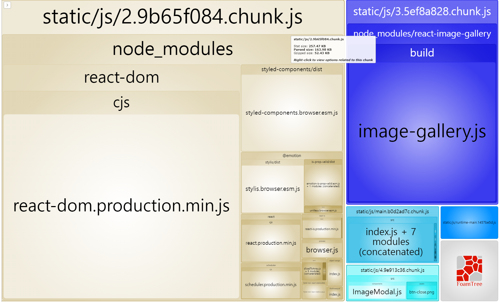
- 실제로도 Modal을 열 때 `2.chunk.js`와 `3.chunk.js`가 로딩됨을 확인할 수 있다.
	- 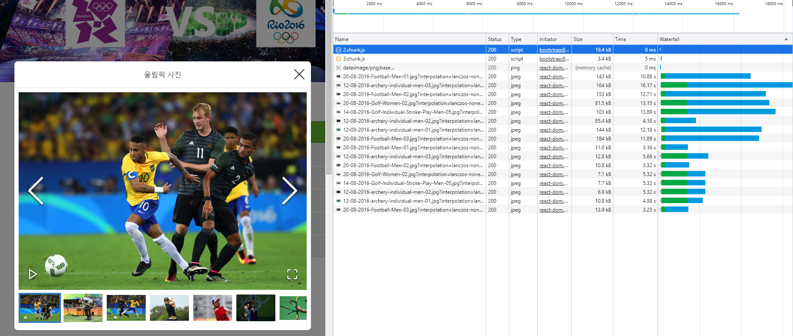

---

## 개념 3. 사전 로딩

#### 사전 로딩의 지연 시간 확인
- Splitting된 Code는 첫 접근을 빠르게 하지만 이후의 모든 접근에 대해 추가 로딩이 생긴다.
- 지연을 체감하기 위해 `Fast 3G`로 놓고 modal 지연 시간을 확인한다.
	- 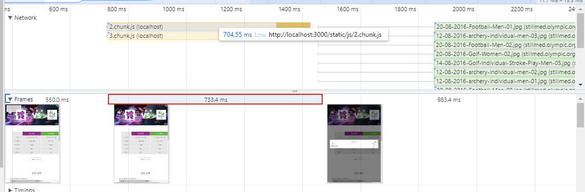
	- 안타깝게도 스크립트 다운로드에 704ms이 걸린다.
	- 그로 인한 Idle Frame도 733ms 만큼 발생한다.
- 생각보다 스크립트 실행은 얼마 걸리지 않아서 `CPU 4x slowdown`(일반적인 모바일 기준)으로 다시 실행해봤다.
	- 이유는 모르겠지만 총 Idle Frame은 1066ms나 되었다.
		- `3.chunk.js`가 Image Gallery 컴포넌트인데 915ms가 걸렸다.
		- 스크립트 실행 시간은 150ms 정도 걸렸다 (vs PC=30ms)
		- 

#### 사전 로딩 해결
- 사전 로딩은 언제 하면 좋을까? 
	- 첫 화면의 로딩이 끝나는 시점 -> `componentDidMount`
	- 네비게이션 요소에 hover 되는 시점 -> `mouseenter`
- 생각해본다면 두 전략은 장단점이 있을 것이다.
	- 첫 화면의 로딩이 끝날 때 로딩하면 불필요한 로딩이 될 확률이 높을 것이고
	- 네비게이션 요소에 hover 될 때 로딩하면 지연이 발생할 확률이 높을 것이다.
- `componentDidMount`에서 사전 로딩하기
	- `dynamic import`에 대한 설명이 없어 참고했다.
		- https://stackoverflow.com/a/67707793
	- 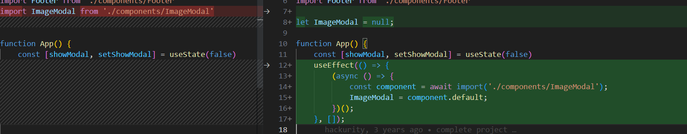
- `onMouseEnter`에서 사전 로딩하기
	- how?

#### 이미지 사전 로딩
- `new Image().src = "이미지 주소"`를 실행하는 순간 로딩이 시작된다.
- 이후 동일 리소스 요청 시에는 Disk Cache에서 불러오는 원리이다.
- Modal을 열기 전에 이미지가 로딩됨을 확인할 수 있다.
	- 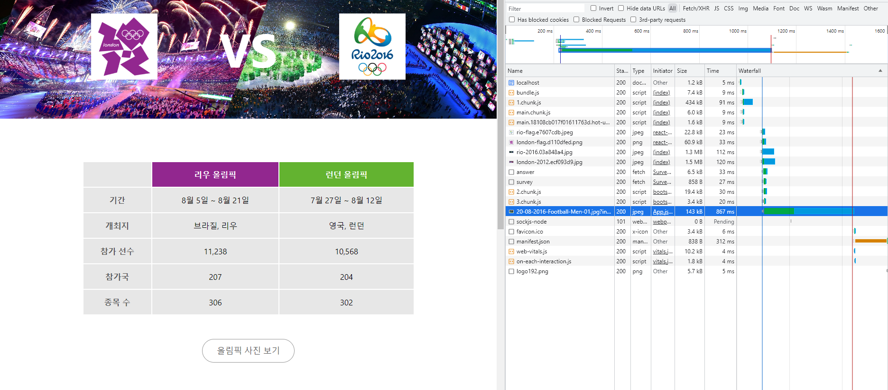
- `componentDidMount`에서 해당 코드를 실행할 수 있다.
	- Q. 만약 다운로드가 끝나기 전에 재요청(Modal open)하면 중복 요청하게 될까?

---

## 잘 모르겠는 부분

#### 이미지 사전 로딩 시 기존 다운로드가 끝나기 전에 재요청(Modal open)하면 중복 요청하게 될까?

#### Performance 탭에서 frame 별로 Main 서브 탭에 표시하는 법?
- 아래 책 내용처럼 점선으로 된 구분선이 표시되지 않는다 (그저 zoom에 따라 5ms, 10ms, 20ms 단위의 구간만 표시됨...)
- 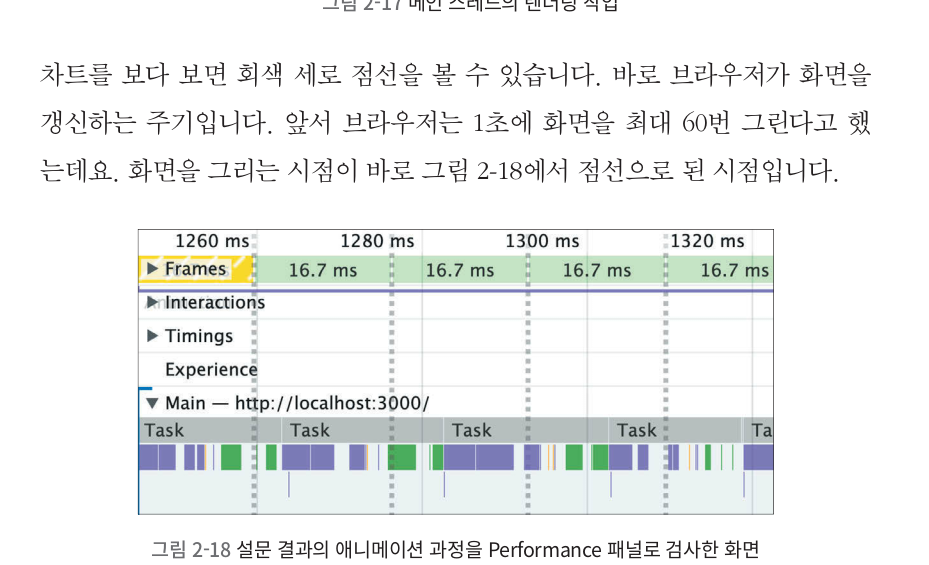

#### 브라우저 렌더링 과정을 100% 모두 재실행하지는 않을텐데 얼마나 다시 실행하는지 알 수 있을까?
- So if there is one take away from this question, it’s that the layout process is complicated and it’s probably best to assume that the entire DOM is always in scope. => **Layout 과정은 복잡해서 전부 다 Layout 대상이라고 생각하는 게 최선이라고 함**
- https://james-priest.github.io/udacity-nanodegree-mws/course-notes/browser-rendering-optimization.html (9.11 챕터 시작 전의 단락에 나와 있음)
	- 재밌는 점: 이 사람은 Mobile Web Specialist라는 Udacity nanodegree를 글로 정리했음 (https://github.com/james-priest/udacity-nanodegree-mws)

#### Reflow = 렌더링 과정 전체를 일컫는 말?
- Reflow는 Layout을 가리키는 용어가 아닌가? (잘 모름)
- 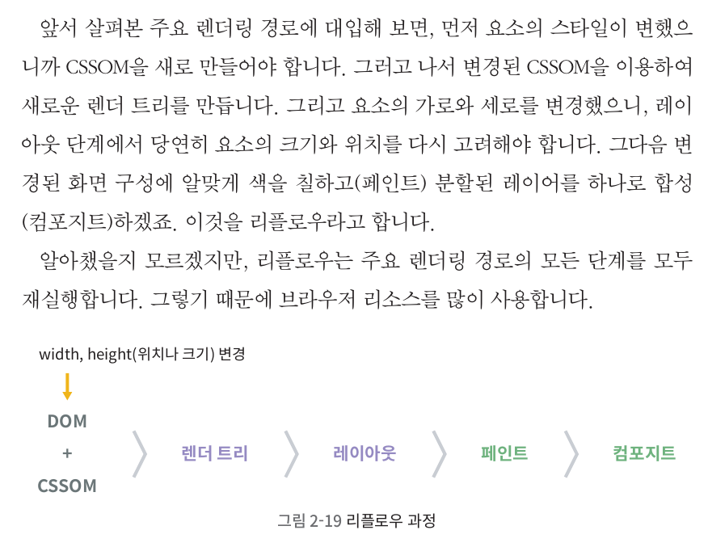

#### 

---

## 찾아본 내용

#### DOM이 크면 Layout이 느려진다.
- https://web.dev/reduce-the-scope-and-complexity-of-style-calculations/
	- Layout 작업 자체가 느린 예시
	- 
	- Recalculate Style이 752ms ...? 
	- 프레임 하나를 못 그리는 수준을 넘어 화면이 멈췄을 것 같다...? (메인 스레드니까?)

